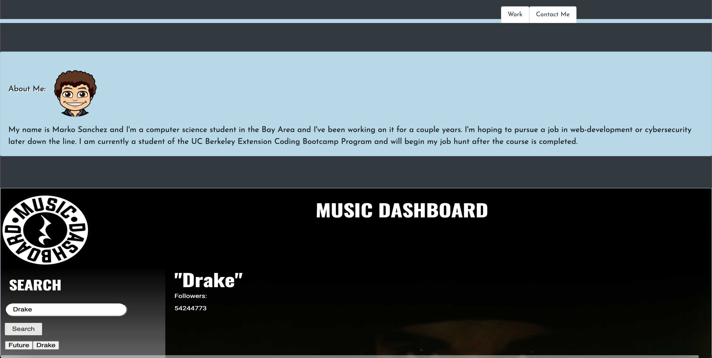

# Portfolio

## Site Image

## Deployed Site 
[Site](https://markosanchez800.github.io/my-portfolio/)

## Summary
This is a portfolio entailing all the important information about myself such as my important projects, links to get in contact with me, and a downloadable copy of my resume. I utilized Bootstrap CSS to create the styling and some custom CSS as well for the aesthetics of the page.

## Technologies used 
- HTML - Used for the general frame and layout of the site
- CSS - Deeper styling such as colors, borders, and highlights for certain elements
- Bootstrap - Used for the makeup of the page elements such as the info cards and the navigation links located in the header

### Author Links
- [LinkedIn] (https://www.linkedin.com/in/marko-sanchez-800)
- [GitHub] (https://github.com/markosanchez800)